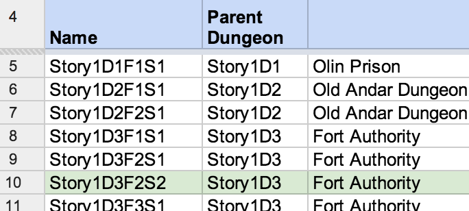
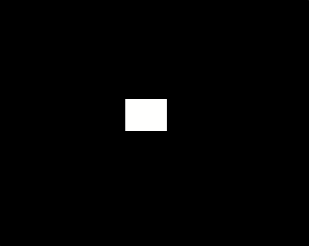
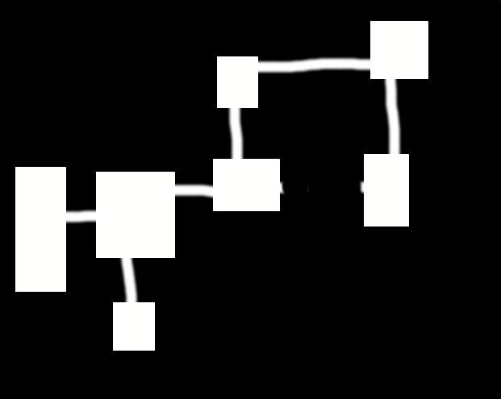
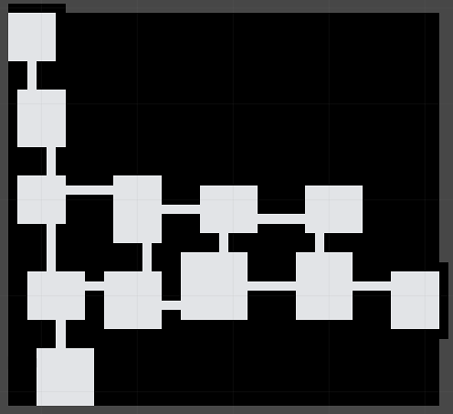

# Dungeon Generation in LootQuest

## Tanner Rogalsky

Unity Developers Meetup, 2014-01

---

# 3 parts
- How Things Work
- How Things Don't Work
- How We Might Turn The Latter Things Into Those Better First Things

---

# How Things Work

---

## Get The Data


---

## Parse The Data
- Number of rooms, size of rooms.
- How far apart are the rooms.
- How many rooms make the shortest path through the dungeon.
- Can we have deadends? How long are they?

---

## Balance
- Recieving and prioritizing arguments.
- Number of rooms is less important than the shortest path through the dungeon.

---

# Let's Make A Dungeon
- Number of rooms: 7
- Critical path length: 6
- Max deadend length: 1

---

### It Begins With A Seed


---

### You Must Choose a Path


___

### Follow That Path!


___

### Put Down Another Room


___

### Do It A Whoooole Bunch


___

### Now Paths!


___

### Now ... Fewer Paths!


___

### Validation


___

### In Unity


___

### I Like That But Can You Make It... More?


___

# Now Let's Add Some Data
- Bitmasking
- Encounters
- Loot
- Events

___

## Bitmasking
http://www.angryfishstudios.com/2011/04/adventures-in-bitmasking/

___

### Step 1: Done!


___

### Step 2: Bit...


---

```csharp
public byte TileHash(DungeonTile tile){
  // the bitmask value accumulator
  byte hash = 0;
  // used as the power value
  // (effect the position of the bit you are flipping)
  int index = 3;
  // iterate over every neighbouring tile
  IEnumerable neibours = this.Parent.GetIterator(tile.X - 1, tile.Y - 1, 3, 3);
  foreach(DungeonTile adjacent in neibours){
    // don't look at diagonal tiles
    if ((tile.X == adjacent.X) ^ (tile.Y == adjacent.Y)){
      // IntValue is 0 or 1 depend on if the tile has been "set"
      int tileValue = adjacent.IntValue;
      byte adjacentValue = (byte) (tileValue * Math.Pow(2, index));
      // accumulate you bitmask value and change your bit position
      hash += adjacentValue;
      index--;
    }
  }
  return hash;
}
```

___

### Step 2 ½: ... Mask


---

```csharp
public static Dictionary<byte, TileType> mask = new Dictionary<byte, TileType>{
  {Convert.ToByte("0000", 2), TileType.Empty},
  {Convert.ToByte("0011", 2), TileType.NorthWest},
  {Convert.ToByte("0101", 2), TileType.NorthEast},
  {Convert.ToByte("1010", 2), TileType.SouthWest},
  {Convert.ToByte("1100", 2), TileType.SouthEast},
  {Convert.ToByte("0111", 2), TileType.North},
  {Convert.ToByte("1011", 2), TileType.West},
  {Convert.ToByte("1101", 2), TileType.East},
  {Convert.ToByte("1110", 2), TileType.South},
  {Convert.ToByte("1111", 2), TileType.Inner}
};
```

___

### Putting It All Together!


___


___


___

# How Things Don't Work
- Turns out that connecting X random dungeons is sort of a hard thing.
- It's not cheap to fail.
- Can't really make rooms in other shapes.
- There's a lot of empty space between rooms.

---

## Connecting X Random Dungeons
- Build the main path through all the dungeons first and then populate branches and everything else.
- Build a coordinate-agnostic node graph first and then place them in cartestian space.

---

## Not Cheap To Fail
- Fail less.
- Learning! Remember bad seeds (determinism is amazing).
- Fail faster.

---

## So Many Rectangles
- Post-process / Just let the renderer handle it.
- So much more bitmasking.
- Have you tried... not being on a grid?

---

## Too Much Empty Space
> Space is big. You just won't believe how vastly, hugely, mind- bogglingly big it is. I mean, you may think it's a long way down the road to the chemist's, but that's just peanuts to space.

- Fill it with pretty things.
- Fill it with more dungeon.

---

# Thank You
